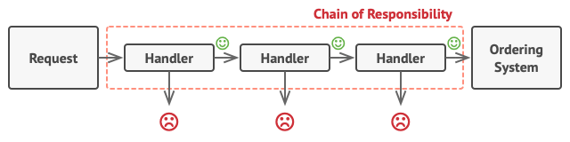

# Chain of Responsibility Pattern

<p align="center">
  
</p>

The Chain of Responsibility pattern is a behavioral design pattern that allows an object to pass a request along a chain of handlers. Each handler in the chain has the opportunity to handle the request or pass it to the next handler in the chain. This pattern decouples senders and receivers of a request, enabling multiple objects to handle the request without explicitly knowing which object will handle it.

## Problem

In software development, there are scenarios where multiple objects may need to process a request, but the specific handler for the request may not be known in advance. Directly coupling the sender of the request to its receiver can lead to several issues:

- Tight coupling: The sender of the request is directly dependent on the receiver, making the code less flexible and harder to maintain.
- Single point of failure: If the receiver is unavailable or unable to handle the request, the sender may not be able to proceed with the request, leading to potential system failures or bottlenecks.
- Lack of flexibility: Changing the processing logic or adding new handlers requires modifying the sender code, violating the principle of open/closed principle.

## Solution

The Chain of Responsibility pattern addresses these issues by decoupling senders and receivers of a request and allowing multiple objects to handle the request in a chain. Each handler in the chain has the opportunity to process the request or pass it to the next handler. This promotes flexibility, scalability, and extensibility by allowing new handlers to be added or existing ones to be modified without changing the sender code.

## Implementation

### Structure

The Chain of Responsibility pattern typically consists of the following components:

- **Handler**: Defines an interface for handling requests and optionally implements the successor link to refer to the next handler in the chain.
- **Concrete Handler**: Implements the Handler interface and handles requests it is responsible for. It may also forward requests to the next handler in the chain.
- **Client**: Sends requests to the first handler in the chain.

### Example

Consider a scenario where we need to login and we have databese `using singleton design pattern`

```java
import java.util.HashMap;
import java.util.Map;

public class Database {
    private  Map<String, String> users;
    private static  Database instance ;


    private Database() {}
    public static Database getDatabase() {
        if (instance == null) {
            instance = new Database();
            instance.users = new HashMap<>();
        }
        return instance;
    }

    void addUser (String username, String password) {
        users.put(username, password);
    }
    public  boolean isValidUser(String user){
        return  users.containsKey(user);
    }
    public boolean isValidPassword(String password){
        return  users.containsValue(password);
    }


}
```

```java
public interface LoginHandler {
    void setNextHandler(LoginHandler loginHandler);
    void handleLogin(String username , String password);
}
```

```java
public class UsernameHandler implements  LoginHandler{
    private  LoginHandler loginHandler;
    @Override
    public void setNextHandler(LoginHandler loginHandler) {
        this.loginHandler = loginHandler;
    }

    @Override
    public void handleLogin(String username, String password) {
        if(Database.getDatabase().isValidUser(username)){
            loginHandler.handleLogin(username, password);
        }else {
            System.out.println("not valid username");
        }
    }
}

```

```java
public class PasswordHandler implements LoginHandler{
    private  LoginHandler loginHandler;
    @Override
    public void setNextHandler(LoginHandler loginHandler) {
        this.loginHandler = loginHandler;
    }

    @Override
    public void handleLogin(String username, String password) {

        if(Database.getDatabase().isValidPassword(password)){
            System.out.println("success login");
        }else {
            System.out.println("not valid password");

        }
    }
}


```

in client code

```java
// Client
public class Main {
    public static void main(String[] args) {
        Database D1 = Database.getDatabase();
        D1.addUser("Youssef","12345678");
        UsernameHandler usernameHandler = new UsernameHandler();
        PasswordHandler passwordHandler =new PasswordHandler();
        usernameHandler.setNextHandler(passwordHandler);
        usernameHandler.handleLogin("Youssef","12345678");
        usernameHandler.handleLogin("Yousssef","12345678");
        usernameHandler.handleLogin("Youssef","12s345678");

    }
}
```

### output

```
success login
not valid username
not valid password
```

## Benefits

Decouples senders and receivers of a request, promoting flexibility and scalability.

Enables multiple objects to handle a request without explicitly knowing which object will handle it.

Supports dynamic configuration of the chain, allowing handlers to be added or modified at runtime.

## Considerations

Handlers should avoid creating tight coupling between each other, as this may reduce the flexibility and extensibility of the chain.

Care should be taken to avoid infinite loops or circular references in the chain, which may cause processing delays or system failures.
