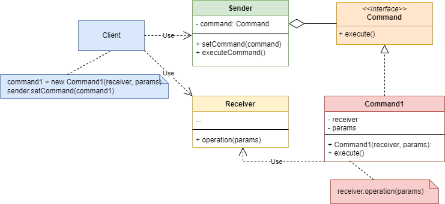

# Command Design Pattern

<p align="center">
  
</p>

The Command pattern is a behavioral design pattern that encapsulates a request as an object, thereby allowing for parameterization of clients with queues, requests, and operations. It enables the separation of the requester of a task from the object that performs the task, providing flexibility, extensibility, and decoupling in command invocation.

## Problem

In software development, there are scenarios where the requester of a task and the object that performs the task need to be decoupled. Directly coupling the requester to the implementation of the task can lead to several issues:

- Tight coupling: The requester of the task is directly dependent on the implementation, making the code less flexible and harder to maintain.
- Lack of flexibility: Changing the implementation of the task requires modifying the requester code, violating the principle of open/closed principle.
- Difficulty in managing requests: Managing requests and their execution order can become complex when dealing with multiple tasks and requesters.

## Solution

The Command pattern addresses these issues by encapsulating a request as an object, which allows the requester to parameterize clients with queues, requests, and operations. It defines a common interface for all commands, enabling requesters to interact with commands uniformly. This promotes flexibility, extensibility, and decoupling in command invocation, as requesters do not need to know the specifics of command implementation.

## Implementation

### Structure

The Command pattern typically consists of the following components:

- **Command**: Defines an interface for executing an operation.
- **Concrete Command**: Implements the Command interface and encapsulates a request as an object.
- **Invoker**: Asks the command to carry out the request.
- **Receiver**: Knows how to perform the operation associated with the command.

### Example

Consider a scenario where we need to implement a button i have two functionality

```java
public interface Command {
    void excute();
}
```

```java
public class LightRed implements Command {
    Lamp lamp;

    public LightRed(Lamp lamp) {
        this.lamp = lamp;
    }

    @Override
    public void excute() {
        lamp.lightRed();
    }
}
```

```java
public class LightBlue implements  Command{
    Lamp lamp;

    public LightBlue(Lamp lamp) {
        this.lamp = lamp;
    }

    @Override
    public void excute() {
        lamp.lightBlue();
    }
}
```

```java
public class Lamp {
    void lightRed(){
        System.out.println("light red");
    }
    void lightBlue(){
        System.out.println("light blue");
    }
}
```

```java
public class Button {
    private Command command;

    public void setCommand(Command command) {
        this.command = command;
    }
    public  void  executeCommand(){
        command.excute();
    }
}
```

```java
// Client
public class Main {
    public static void main(String[] args) {
        Button button = new Button();
        Lamp lamp = new Lamp();
        LightBlue lightBlue = new LightBlue(lamp);
        LightRed lightRed = new LightRed(lamp);
        button.setCommand(lightBlue);
        button.executeCommand();
        button.setCommand(lightRed);
        button.executeCommand();

    }
}
```

## Benefits

Decouples the requester of a task from the object that performs the task, promoting flexibility and extensibility.

Enables parameterization of clients with queues, requests, and operations, allowing for easy management of requests and their execution order.

Provides a uniform interface for interacting with commands, making it easy to add new commands without modifying existing code.

## Considerations

Care should be taken to properly design and organize commands to avoid bloating the command hierarchy and maintainability issues.

Commands should be designed to be small, focused, and reusable to maximize flexibility and maintainability.
