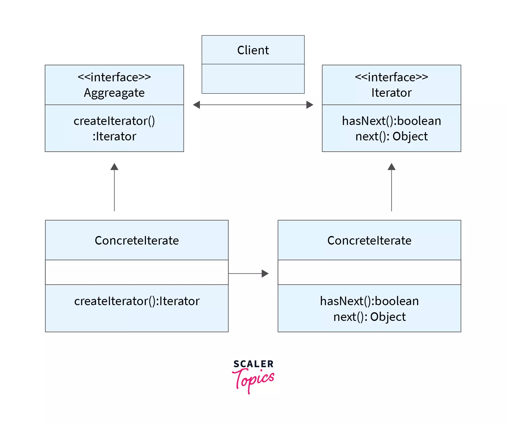

# Iterator Design Pattern

<p align="center">
  
</p>

The Iterator pattern is a behavioral design pattern that provides a way to access the elements of an aggregate object sequentially without exposing its underlying representation. It encapsulates the traversal of a collection and decouples the client code from the collection's implementation, promoting loose coupling and enhancing flexibility.

## Problem

In software development, there are scenarios where client code needs to iterate over the elements of a collection (e.g., list, array) without being aware of its internal representation (e.g., array, linked list). However, directly exposing the internal structure of the collection or using specific traversal algorithms in client code can lead to several issues:

- Tight coupling: Client code becomes tightly coupled to the specific implementation of the collection, making it difficult to change or extend the collection's implementation.
- Lack of flexibility: Changing the collection's internal representation requires modifying client code, violating the principle of open/closed principle.
- Code duplication: Traversal logic may be duplicated across multiple client classes, leading to maintenance issues and inconsistencies.

## Solution

The Iterator pattern addresses these issues by providing a way to access the elements of a collection sequentially without exposing its internal representation. It defines a separate iterator object that encapsulates the traversal logic and provides a uniform interface for accessing elements. This decouples the client code from the collection's implementation, promoting loose coupling and enhancing flexibility.

## Implementation

### Structure

The Iterator pattern typically consists of the following components:

- **Iterator**: Defines an interface for accessing and traversing elements of a collection.
- **Concrete Iterator**: Implements the Iterator interface and provides specific traversal logic for a particular collection.
- **Aggregate**: Defines an interface for creating an iterator object.
- **Concrete Aggregate**: Implements the Aggregate interface and provides a way to create iterator objects for a specific collection.
- **Client**: Interacts with the iterator and aggregate objects to traverse the collection and access its elements.

### Example

Consider a scenario where we need to implement an iterator for a custom collection (e.g., custom list) using the Iterator pattern:

```java
// Iterator
interface Iterator<T> {
    boolean hasNext();
    T next();
}

// Aggregate
interface IterableCollection<T> {
    Iterator<T> createIterator();
}

// Concrete Iterator
class CustomListIterator<T> implements Iterator<T> {
    private final T[] elements;
    private int currentIndex = 0;

    public CustomListIterator(T[] elements) {
        this.elements = elements;
    }

    @Override
    public boolean hasNext() {
        return currentIndex < elements.length;
    }

    @Override
    public T next() {
        if (!hasNext()) {
            throw new NoSuchElementException();
        }
        return elements[currentIndex++];
    }
}

// Concrete Aggregate
class CustomList<T> implements IterableCollection<T> {
    private final T[] elements;

    public CustomList(T[] elements) {
        this.elements = elements;
    }

    @Override
    public Iterator<T> createIterator() {
        return new CustomListIterator<>(elements);
    }
}

// Client
public class Main {
    public static void main(String[] args) {
        Integer[] numbers = {1, 2, 3, 4, 5};
        IterableCollection<Integer> collection = new CustomList<>(numbers);
        Iterator<Integer> iterator = collection.createIterator();

        while (iterator.hasNext()) {
            System.out.println(iterator.next());
        }
    }
}
```

## Benefits
Promotes loose coupling between client code and the collection's implementation, making the code easier to maintain and extend.

Encapsulates traversal logic into separate iterator objects, allowing for flexibility in iterating over different types of collections.

Enhances code readability and reusability by providing a uniform interface for accessing elements of a collection.

## Considerations
Care should be taken to properly implement iterator objects to ensure correct traversal and element access behavior.

Iterators should be designed to handle edge cases and boundary conditions gracefully to prevent runtime errors.