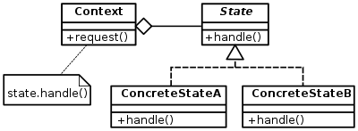

# State Design Pattern

<p align="center">
  
</p>


The State pattern is a behavioral design pattern that allows an object to alter its behavior when its internal state changes. It encapsulates state-specific behavior into separate state objects and delegates state transitions to these objects, promoting loose coupling and simplifying state-dependent logic.

## Problem

In software development, there are scenarios where an object's behavior needs to change dynamically based on its internal state. However, implementing state-dependent logic directly in the object's methods can lead to several issues:

- Code duplication: State-dependent logic may be duplicated across multiple methods of the object, leading to maintenance issues and inconsistencies.
- Lack of flexibility: Adding or modifying states and their corresponding behaviors requires modifying existing code, violating the principle of open/closed principle.
- Tight coupling: Objects become tightly coupled to specific states, making it difficult to extend or modify their behavior independently of their states.

## Solution

The State pattern addresses these issues by encapsulating state-specific behavior into separate state objects and delegating state transitions to these objects. It allows objects to change their behavior dynamically by changing their internal state, promoting loose coupling and simplifying state-dependent logic.

## Implementation

### Structure

The State pattern typically consists of the following components:

- **Context**: Defines an interface for clients to interact with the state objects and maintains a reference to the current state object.
- **State**: Defines an interface for encapsulating state-specific behavior and declaring methods for state transitions.
- **Concrete State**: Implements the State interface and provides state-specific behavior for the context.
- **Client**: Interacts with the context to trigger state transitions and perform state-dependent operations.

### Example

Consider a scenario where we need to implement a Light system

```java
public interface StateOfLamp {
    void changeState(Lamp lamp);
    void  functionOfState(Lamp lamp);
}
```

```java


public class OffState implements StateOfLamp {
    private StateOfLamp nextState;

    public OffState(StateOfLamp nextState) {
        this.nextState = nextState;
    }

    @Override
    public void changeState(Lamp lamp) {
        lamp.setCurrentState(nextState);
    }

    @Override
    public void functionOfState(Lamp lamp) {
        System.out.println("off state");
    }
}
```

```java

public class RedLightState implements StateOfLamp {
    private StateOfLamp nextState;

    public RedLightState(StateOfLamp nextState) {
        this.nextState = nextState;
    }

    @Override
    public void changeState(Lamp lamp) {
        lamp.setCurrentState(nextState);

    }

    @Override
    public void functionOfState(Lamp lamp) {
        System.out.println("Red light");

    }
}

```

```java


public class BlueLightState implements StateOfLamp{
    private StateOfLamp nextState;

    public BlueLightState(StateOfLamp nextState) {
        this.nextState = nextState;
    }

    @Override
    public void changeState(Lamp lamp) {
        lamp.setCurrentState(nextState);

    }

    @Override
    public void functionOfState(Lamp lamp) {
        System.out.println("Blue light");
    }
}

```

``` java

public class Lamp {
    StateOfLamp currentState;
    StateOfLamp intialState;

    public Lamp(StateOfLamp currentState) {
        this.currentState = currentState;
        this.intialState = currentState;
    }

    public void setCurrentState(StateOfLamp currentState) {
        if (currentState == null){
            this.currentState = intialState;
            return;
        }
        this.currentState = currentState;
    }
    public void nextState(){
     this.currentState.changeState(this);
    }
    public void doFunction(){
        currentState.functionOfState(this);
    }
}

```

```java
public class Main {
    public static void main(String[] args) {
        // Create states
        BlueLightState blueLightState = new BlueLightState(null);
        RedLightState redLightState = new RedLightState(blueLightState);
        OffState offState = new OffState(redLightState);
        Lamp lamp = new Lamp(offState);

        lamp.doFunction(); // off state
        lamp.nextState();
        lamp.doFunction(); // red state
        lamp.nextState();
        lamp.doFunction(); // blue state
        lamp.nextState();
        lamp.doFunction(); // off state
        lamp.nextState();
        lamp.doFunction();// red state
        lamp.nextState();
        lamp.doFunction(); //blue state
        lamp.nextState();
        lamp.doFunction(); //off state
    }
}
```

## Benefits
Promotes loose coupling between objects, making the code easier to maintain and extend.

Simplifies state-dependent logic by encapsulating state-specific behavior into separate state objects.

Enables objects to change their behavior dynamically by changing their internal state.

## Considerations

Care should be taken to properly design state transitions and state-specific behavior to avoid inconsistent or unexpected behavior.

The context object should manage state transitions carefully to maintain data integrity and avoid unintended side effects.
