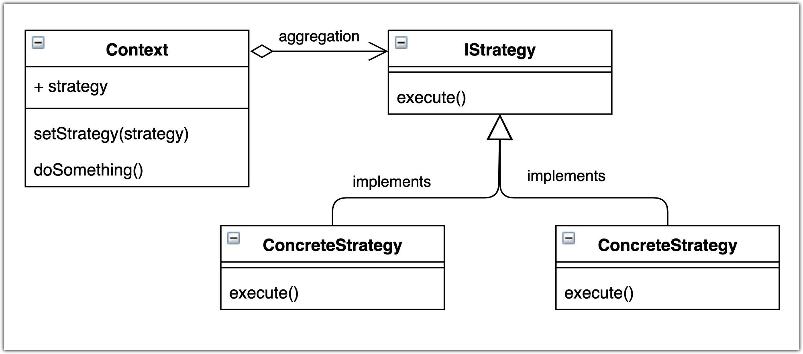

# Strategy Design Pattern

<p align="center">
  
</p>


The Strategy pattern is a behavioral design pattern that defines a family of algorithms, encapsulates each algorithm, and makes them interchangeable. It enables clients to choose the appropriate algorithm dynamically without depending on specific implementations, promoting flexibility, and facilitating algorithm reuse.

## Problem

In software development, there are scenarios where multiple algorithms perform the same task but with variations in their implementations. However, implementing these algorithms directly in client code or using conditional statements can lead to several issues:

- Code duplication: Similar algorithms may be duplicated across multiple client classes, leading to maintenance issues and inconsistencies.
- Lack of flexibility: Hardcoding specific algorithms in client code makes it difficult to switch between algorithms dynamically or add new algorithms without modifying existing code.
- Violation of the open/closed principle: Adding new algorithms or modifying existing ones requires changes to client code, violating the principle of open/closed principle.

## Solution

The Strategy pattern addresses these issues by encapsulating each algorithm into separate strategy objects and allowing clients to choose the appropriate strategy dynamically. It decouples the algorithm implementation from the client code, promoting flexibility, facilitating algorithm reuse, and ensuring that client code remains unaffected by changes in algorithms.

## Implementation

### Structure

The Strategy pattern typically consists of the following components:

- **Context**: Maintains a reference to a strategy object and delegates the execution of the algorithm to the strategy object.
- **Strategy**: Defines an interface for encapsulating the algorithm.
- **Concrete Strategy**: Implements the Strategy interface and provides specific implementations of the algorithm.
- **Client**: Interacts with the context object and selects the appropriate strategy dynamically.

### Example

Consider a scenario where we need to implement a sorting algorithm using the Strategy pattern, allowing clients to choose between different sorting algorithms dynamically:

```java
// Strategy
interface SortingStrategy {
    void sort(int[] array);
}

// Concrete Strategies
class BubbleSortStrategy implements SortingStrategy {
    @Override
    public void sort(int[] array) {
        // Implement bubble sort algorithm
        System.out.println("Sorting array using Bubble Sort");
    }
}

class QuickSortStrategy implements SortingStrategy {
    @Override
    public void sort(int[] array) {
        // Implement quick sort algorithm
        System.out.println("Sorting array using Quick Sort");
    }
}

// Context
class SortingContext {
    private SortingStrategy strategy;

    public void setStrategy(SortingStrategy strategy) {
        this.strategy = strategy;
    }

    public void performSort(int[] array) {
        strategy.sort(array);
    }
}

// Client
public class Main {
    public static void main(String[] args) {
        SortingContext context = new SortingContext();

        // Using Bubble Sort
        context.setStrategy(new BubbleSortStrategy());
        int[] array1 = {5, 2, 7, 1, 3};
        context.performSort(array1); // Output: Sorting array using Bubble Sort

        // Using Quick Sort
        context.setStrategy(new QuickSortStrategy());
        int[] array2 = {10, 4, 8, 6, 9};
        context.performSort(array2); // Output: Sorting array using Quick Sort
    }
}
```
## Benefits
Promotes flexibility and extensibility by allowing clients to choose between different algorithms dynamically.

Encapsulates algorithms into separate strategy objects, making it easier to maintain and modify them independently.

Facilitates algorithm reuse and promotes code reuse by encapsulating common algorithms into strategy objects.


## Considerations

Care should be taken to properly design strategy interfaces to ensure that different strategies can be used interchangeably.

Strategies should be designed to encapsulate cohesive sets of behavior and avoid bloating with unrelated functionalities.