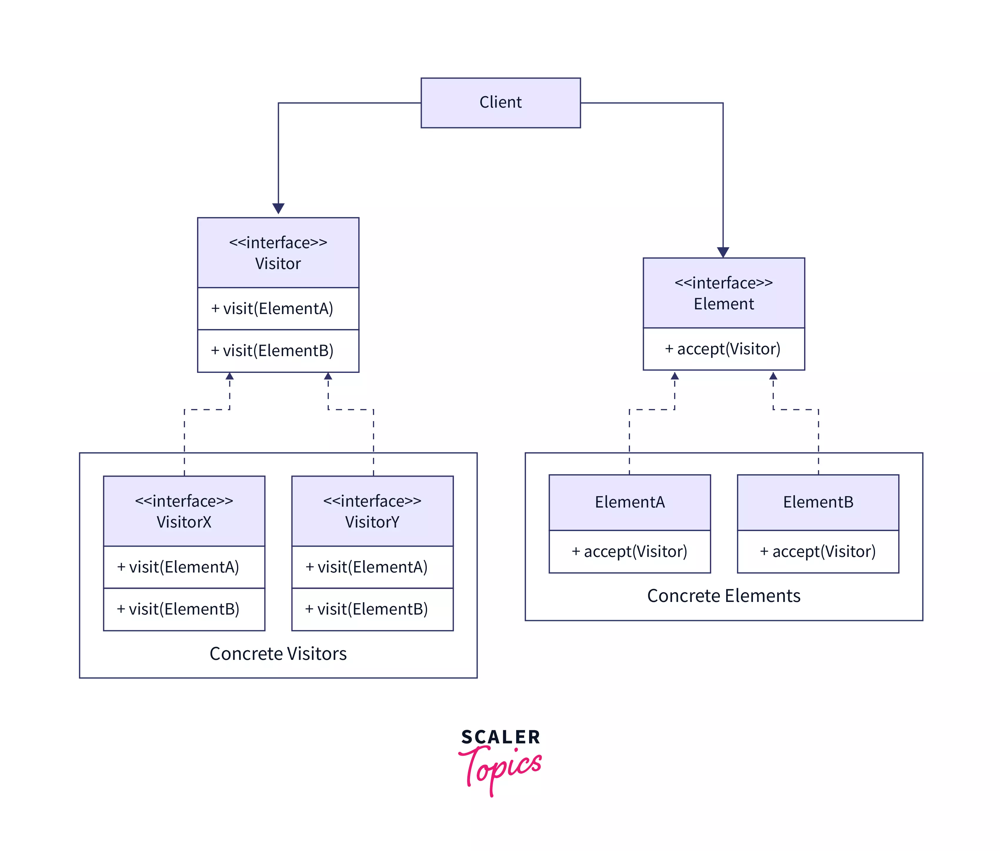

# Visitor Design Pattern


<p align="center">
  
</p>

The Visitor pattern is a behavioral design pattern that allows adding new operations to an object structure without modifying the objects themselves. It separates the algorithm from the object structure by defining a visitor object that traverses the object structure and performs operations on the elements. This promotes extensibility, flexibility, and maintainability by encapsulating operations in separate visitor objects.

## Problem

In software development, there are scenarios where a set of operations needs to be performed on objects belonging to different classes or hierarchies. However, directly adding these operations to the classes can lead to several issues:

- Violation of the open/closed principle: Adding new operations requires modifying existing classes, violating the principle of open/closed principle.
- Tight coupling: Operations are tightly coupled to the classes, making it difficult to add or modify operations without affecting existing code.
- Lack of extensibility: Adding new classes or hierarchies requires modifying existing operations or introducing conditional logic, leading to maintenance issues and code bloat.

## Solution

The Visitor pattern addresses these issues by separating the algorithm from the object structure and encapsulating operations in separate visitor objects. It defines a visitor interface with visit methods for each class or hierarchy of objects. Objects accept visitors, allowing them to traverse the object structure and perform operations on the elements. This promotes extensibility, flexibility, and maintainability by allowing new operations to be added without modifying existing classes.

## Implementation

### Structure

The Visitor pattern typically consists of the following components:

- **Visitor**: Defines an interface with visit methods for each class or hierarchy of objects.
- **Concrete Visitor**: Implements the Visitor interface and provides specific operations on the elements.
- **Element**: Defines an interface for objects in the object structure to accept visitors.
- **Concrete Element**: Implements the Element interface and provides an implementation for accepting visitors.
- **Object Structure**: Represents the collection of elements and provides a way for visitors to traverse the elements.
- **Client**: Interacts with visitor and object structure objects to perform operations on the elements.

### Example

Consider a scenario where we need to implement a visitor for a document editor application that processes different types of elements (e.g., paragraphs, headings) using the Visitor pattern:

```java
// Visitor
interface DocumentVisitor {
    void visit(Paragraph paragraph);
    void visit(Heading heading);
}

// Concrete Visitor
class HtmlExporter implements DocumentVisitor {
    @Override
    public void visit(Paragraph paragraph) {
        System.out.println("<p>" + paragraph.getText() + "</p>");
    }

    @Override
    public void visit(Heading heading) {
        System.out.println("<h" + heading.getLevel() + ">" + heading.getText() + "</h" + heading.getLevel() + ">");
    }
}

// Element
interface DocumentElement {
    void accept(DocumentVisitor visitor);
}

// Concrete Elements
class Paragraph implements DocumentElement {
    private String text;

    public Paragraph(String text) {
        this.text = text;
    }

    public String getText() {
        return text;
    }

    @Override
    public void accept(DocumentVisitor visitor) {
        visitor.visit(this);
    }
}

class Heading implements DocumentElement {
    private int level;
    private String text;

    public Heading(int level, String text) {
        this.level = level;
        this.text = text;
    }

    public int getLevel() {
        return level;
    }

    public String getText() {
        return text;
    }

    @Override
    public void accept(DocumentVisitor visitor) {
        visitor.visit(this);
    }
}

// Object Structure
class Document {
    private List<DocumentElement> elements = new ArrayList<>();

    public void addElement(DocumentElement element) {
        elements.add(element);
    }

    public void export(HtmlExporter exporter) {
        for (DocumentElement element : elements) {
            element.accept(exporter);
        }
    }
}

// Client
public class Main {
    public static void main(String[] args) {
        Document document = new Document();
        document.addElement(new Paragraph("This is a paragraph"));
        document.addElement(new Heading(1, "Heading 1"));

        HtmlExporter exporter = new HtmlExporter();
        document.export(exporter);
    }
}
```


## Benefits
Promotes extensibility and flexibility by allowing new operations to be added without modifying existing classes.

Separates the algorithm from the object structure, making it easier to maintain and extend both components independently.

Facilitates code reuse by encapsulating operations in separate visitor objects, promoting better organization and readability.

## Considerations

Care should be taken to properly design visitor interfaces to ensure that visitors can operate on all elements of the object structure.

Visitors should be designed to handle different types of elements gracefully and avoid violating the principle of least astonishment.