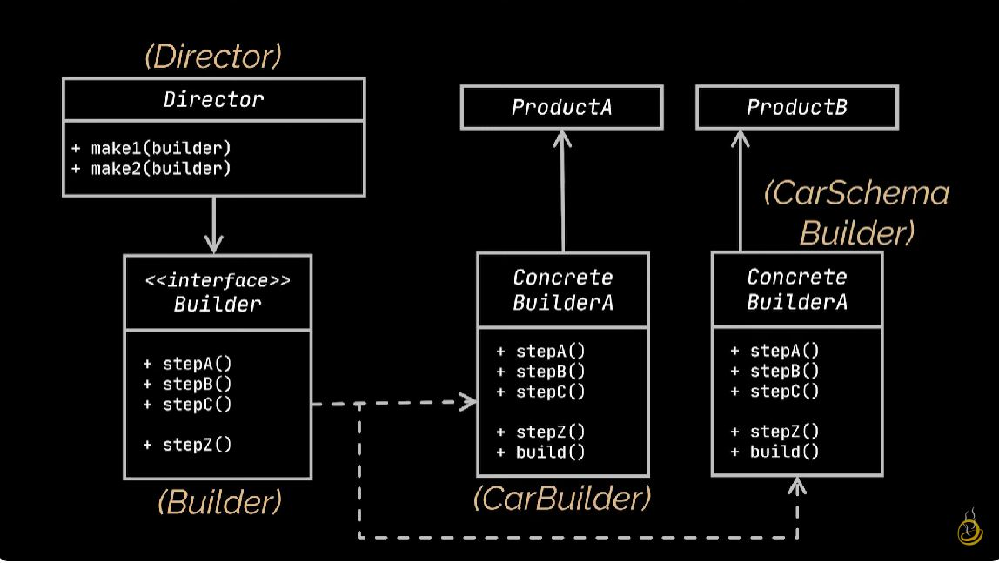

# Builder Pattern

<p align="center">
  
</p>

The Builder pattern is a creational design pattern that separates the construction of a complex object from its representation, allowing the same construction process to create different representations. It simplifies object creation by providing a step-by-step approach to construct objects, enabling the construction of objects with varying properties.

## Problem

In software development, there are scenarios where we need to create complex objects with many optional parameters or configurations. However, directly instantiating these objects with a large number of parameters can lead to several issues:

- Constructor parameter overload: Having a constructor with many parameters can make the code hard to read and maintain.
- Difficulty in understanding object initialization: The purpose of each parameter may not be immediately clear, leading to confusion during object initialization.
- Inflexibility in object creation: Directly instantiating objects with all parameters may not be feasible or practical, especially when only a subset of parameters is needed.

## Solution

The Builder pattern addresses these issues by separating the construction of a complex object from its representation. It provides a Builder interface with methods to set individual parameters of the object, allowing clients to specify only the desired parameters. The Builder then constructs the object step by step, resulting in a clean and flexible object creation process.

## Implementation

### Structure

The Builder pattern typically consists of the following components:

- **Product**: Represents the complex object being constructed.
- **Builder**: Abstract interface that defines methods to build individual parts of the product.
- **Concrete Builder**: Implements the Builder interface to construct and assemble parts of the product.
- **Director**: Manages the construction process by using the Builder to construct the product.
- **Client**: Initiates the construction process by creating a Builder and passing it to the Director.

### Example

Consider a scenario where we need to construct a `Pizza` object with various optional toppings and configurations using the Builder pattern:

```java
// Product
class Pizza {
    private String dough;
    private String sauce;
    private String toppings;

    public void setDough(String dough) {
        this.dough = dough;
    }

    public void setSauce(String sauce) {
        this.sauce = sauce;
    }

    public void setToppings(String toppings) {
        this.toppings = toppings;
    }

    public String getDescription() {
        return "Pizza with " + dough + " dough, " + sauce + " sauce, and toppings: " + toppings;
    }
}

// Builder interface
interface PizzaBuilder {
    void buildDough();
    void buildSauce();
    void buildToppings();
    Pizza getPizza();
}

// Concrete Builder
class HawaiianPizzaBuilder implements PizzaBuilder {
    private Pizza pizza;

    public HawaiianPizzaBuilder() {
        this.pizza = new Pizza();
    }

    @Override
    public void buildDough() {
        pizza.setDough("thick");
    }

    @Override
    public void buildSauce() {
        pizza.setSauce("tomato");
    }

    @Override
    public void buildToppings() {
        pizza.setToppings("ham, pineapple, cheese");
    }

    @Override
    public Pizza getPizza() {
        return pizza;
    }
}

// Concrete Builder
class SpicyPizzaBuilder implements PizzaBuilder {
    private Pizza pizza;

    public SpicyPizzaBuilder() {
        this.pizza = new Pizza();
    }

    @Override
    public void buildDough() {
        pizza.setDough("thin");
    }

    @Override
    public void buildSauce() {
        pizza.setSauce("spicy tomato");
    }

    @Override
    public void buildToppings() {
        pizza.setToppings("pepperoni, jalapenos, cheese");
    }

    @Override
    public Pizza getPizza() {
        return pizza;
    }
}

// Director
class PizzaDirector {
    public void constructPizza(PizzaBuilder pizzaBuilder) {
        pizzaBuilder.buildDough();
        pizzaBuilder.buildSauce();
        pizzaBuilder.buildToppings();
    }
}

// Client
public class Main {
    public static void main(String[] args) {
        // Create a director
        PizzaDirector pizzaDirector = new PizzaDirector();

        // Create a Hawaiian pizza builder
        PizzaBuilder hawaiianPizzaBuilder = new HawaiianPizzaBuilder();

        // Construct a Hawaiian pizza
        pizzaDirector.constructPizza(hawaiianPizzaBuilder);
        Pizza hawaiianPizza = hawaiianPizzaBuilder.getPizza();
        System.out.println("Hawaiian Pizza: " + hawaiianPizza.getDescription());

        // Create a spicy pizza builder
        PizzaBuilder spicyPizzaBuilder = new SpicyPizzaBuilder();

        // Construct a spicy pizza
        pizzaDirector.constructPizza(spicyPizzaBuilder);
        Pizza spicyPizza = spicyPizzaBuilder.getPizza();
        System.out.println("Spicy Pizza: " + spicyPizza.getDescription());
    }
}
```

### Benefits

Simplifies object creation by providing a step-by-step approach to construct objects.

Separates the construction of a complex object from its representation, promoting clean and flexible object creation.

Allows the same construction process to create different representations of the object, enhancing code reuse and maintainability.

### Considerations

May require the creation of multiple Builder implementations for different object configurations, leading to increased complexity.

Clients need to know the details of the Builder interface and its implementations, potentially reducing encapsulation.
