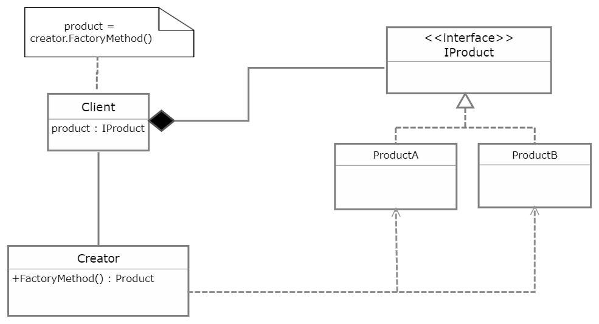

# Factory Method Pattern

<p align="center">
  
</p>

The Factory Method pattern is a creational design pattern that provides an interface for creating objects in a superclass, but allows subclasses to alter the type of objects that will be created. It encapsulates object creation logic, promoting loose coupling between client code and the created objects.

## Problem

In software development, there are scenarios where we need to create objects of different types based on certain conditions or parameters. However, directly instantiating concrete classes in client code can lead to tight coupling and inflexibility. For example:

- If client code directly creates instances of concrete classes, it becomes tightly coupled to those classes, making it difficult to switch to different implementations or extend the system.
- Client code may need to know about the specific implementations of objects, violating the principle of abstraction and encapsulation.

## Solution

The Factory Method pattern addresses these issues by providing an interface for creating objects, but deferring the instantiation to subclasses. This allows subclasses to determine the type of objects that will be created, promoting loose coupling and abstraction.

## Implementation

### Structure

The Factory Method pattern typically consists of the following components:

- **Product**: Defines the interface of objects the factory method creates.
- **Concrete Product**: Implements the Product interface.
- **Creator**: Declares the factory method, which returns an object of type Product.
- **Concrete Creator**: Overrides the factory method to return an instance of a Concrete Product.

### Example

Consider a scenario where we have a Vehicle interface and want to create different types of vehicles (Car, Bike) using the Factory Method pattern:

```java
// Product interface
interface Vehicle {
    void drive();
}

// Concrete Product
class Car implements Vehicle {
    @Override
    public void drive() {
        System.out.println("Driving a car");
    }
}

// Concrete Product
class Bike implements Vehicle {
    @Override
    public void drive() {
        System.out.println("Riding a bike");
    }
}

// Creator interface
interface VehicleFactory {
    Vehicle createVehicle();
}

// Concrete Creator
class CarFactory implements VehicleFactory {
    @Override
    public Vehicle createVehicle() {
        return new Car();
    }
}

// Concrete Creator
class BikeFactory implements VehicleFactory {
    @Override
    public Vehicle createVehicle() {
        return new Bike();
    }
}
```
