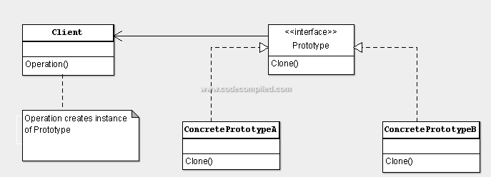

# Prototype Pattern

<p align="center">
  
</p>

The Prototype pattern is a creational design pattern that allows you to create new objects by copying an existing object, known as a prototype. It provides a way to create objects based on a template or prototype instance, reducing the need for subclassing and improving performance by avoiding costly object creation operations.

## Problem

In software development, there are scenarios where you need to create new objects that are similar to existing objects, but with some differences in their properties or states. However, directly instantiating new objects by copying existing ones can lead to several issues:

- Inefficiency: Creating new objects from scratch can be time-consuming and resource-intensive, especially if the object initialization process is complex.
- Duplication of code: If the initialization logic for creating new objects is duplicated across multiple places in the code, it can lead to maintenance issues and inconsistencies.
- Lack of flexibility: Subclassing existing objects to create new ones may not be feasible or practical, especially if the object hierarchy is complex or if there are many variations of objects.

## Solution

The Prototype pattern addresses these issues by providing a way to create new objects by copying an existing prototype. It defines a prototype interface or abstract class with a method for cloning itself, allowing clients to create new objects by cloning an existing prototype instance. This approach promotes code reuse, reduces duplication, and improves performance by avoiding the costly initialization process.

## Implementation

### Structure

The Prototype pattern typically consists of the following components:

- **Prototype**: Declares an interface or abstract class with a method for cloning itself.
- **Concrete Prototype**: Implements the Prototype interface to provide a concrete implementation of the cloning method.
- **Client**: Creates new objects by cloning an existing prototype instance.

### Example

Consider a scenario where we need to create different types of shapes (e.g., circles, squares) using the Prototype pattern:

```java
// Prototype interface
interface Shape extends Cloneable {
    Shape clone();
    void draw();
}

// Concrete Prototype
class Circle implements Shape {
    @Override
    public Shape clone() {
        return new Circle();
    }

    @Override
    public void draw() {
        System.out.println("Drawing a circle");
    }
}

// Concrete Prototype
public abstract class Shape {
    public int x;
    public int y;
    public String color;

    public Shape() {
    }

    public Shape(Shape target) {
        if (target != null) {
            this.x = target.x;
            this.y = target.y;
            this.color = target.color;
        }
    }

    public abstract Shape clone();


}
// sup classes
public class Circle extends Shape {
    public int radius;

    public Circle() {
    }

    public Circle(Circle target) {
        super(target);
        if (target != null) {
            this.radius = target.radius;
        }
    }

    @Override
    public Shape clone() {
        return new Circle(this);
    }

    @Override
    public boolean equals(Object object2) {
        if (!(object2 instanceof Circle) || !super.equals(object2)) return false;
        Circle shape2 = (Circle) object2;
        return shape2.radius == radius;
    }
}

public class Rectangle extends Shape {
    public int width;
    public int height;

    public Rectangle() {
    }

    public Rectangle(Rectangle target) {
        super(target);
        if (target != null) {
            this.width = target.width;
            this.height = target.height;
        }
    }

    @Override
    public Shape clone() {
        return new Rectangle(this);
    }


}
```

### Benefits

Promotes code reuse and avoids duplication by allowing clients to create new objects from existing prototypes.

Improves performance by avoiding costly object creation operations, especially for complex objects with expensive initialization logic.

Provides a flexible way to create new objects with variations in their properties or states without subclassing.

### Considerations

Objects must implement the Cloneable interface and override the clone method, which can be error-prone if not implemented correctly.

Cloning objects with deep hierarchies or complex dependencies may require special handling to ensure proper object copying.
