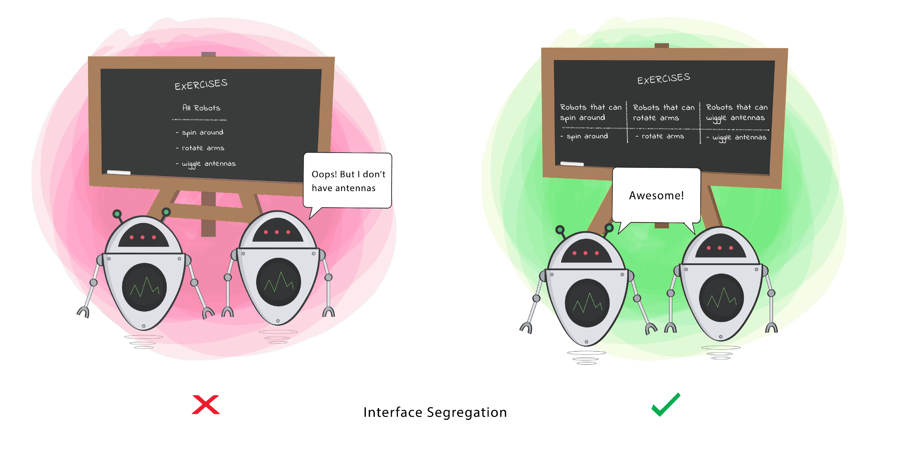

# Interface Segregation Principle (ISP)


<p align="center">
  
</p>


The Interface Segregation Principle (ISP) is a fundamental principle in object-oriented design that states that clients should not be forced to depend on interfaces they do not use. It encourages the segregation of interfaces into smaller, cohesive units, tailored to the specific needs of clients. This principle promotes code modularity, flexibility, and maintainability by preventing the creation of overly large or monolithic interfaces.

## Problem

In software development, interfaces often define a set of methods or properties that cater to multiple clients or use cases. However, when interfaces become too large or complex, clients may be forced to depend on methods they do not need, leading to several issues, including:

- **Interface pollution**: Interfaces with a large number of methods or properties may contain unnecessary or irrelevant functionality, leading to interface pollution and reduced clarity.
- **Client dependencies**: Clients that depend on large interfaces may be forced to implement or override methods they do not use, leading to unnecessary dependencies and tight coupling.
- **Difficulty in maintenance**: Large interfaces are more difficult to maintain and extend, as changes to one part of the interface may affect unrelated parts, leading to code fragility and regression issues.

## Solution

The Interface Segregation Principle addresses these issues by advocating for the segregation of interfaces into smaller, cohesive units that are tailored to the specific needs of clients. Instead of creating large, monolithic interfaces, interfaces should be designed to cater to specific client requirements, promoting code modularity, flexibility, and maintainability.

## Implementation

### Example

Consider a scenario where we have a `Document` interface that is intended to be implemented by different types of documents, such as `TextDocument`, `SpreadsheetDocument`, and `PresentationDocument`:

```java
interface Openable {
    void open();
    void save();
    void print();
}
// Now, suppose we have a client that only needs to work with text documents and does not require the ability to save or print documents:

class Document implements Openable, Savable {
    @Override
    public void open() {
        System.out.println("Document opened.");
    }

    @Override
    public void save() {
        System.out.println("Document saved.");
    }
        @Override
    public void print() {
      // i don't want print here
    }
}

//Violation of ISP
// The TextEditor class depends on the Document interface, which includes methods (save() and print()) that are not used by the client. This violates the Interface Segregation Principle, as the client is forced to depend on functionality it does not need. 

// Refactoring
// To adhere to the ISP, we can segregate the Document interface into smaller, more cohesive interfaces that cater to specific client requirements:

interface Openable {
    void open();
}

interface Savable {
    void save();
}

interface Printable {
    void print();
}

class Document implements Openable, Savable {
    @Override
    public void open() {
        System.out.println("Document opened.");
    }

    @Override
    public void save() {
        System.out.println("Document saved.");
    }
}

```
## Benefits
Code modularity: Segregating interfaces into smaller units reduces interface pollution and promotes code modularity and clarity.

Client flexibility: Clients can depend only on the interfaces they need, reducing unnecessary dependencies and promoting loose coupling.

Ease of maintenance: Smaller interfaces are easier to maintain and extend, as changes to one interface do not affect unrelated clients or implementations.

## Considerations
Granularity: Care should be taken to strike a balance between granularity and cohesion when segregating interfaces, ensuring that interfaces remain cohesive and relevant to clients.

Design consistency: Consistent application of the Interface Segregation Principle across the codebase ensures predictable behavior and promotes code maintainability and extensibility.