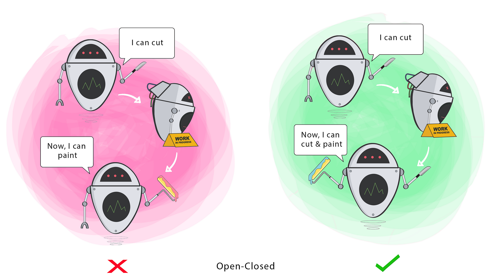

# Open/Closed Principle (OCP)

<p align="center">
  
</p>

The Open/Closed Principle (OCP) is a fundamental principle in software engineering that states that software entities (classes, modules, functions, etc.) should be open for extension but closed for modification. This principle promotes code maintainability, extensibility, and robustness by allowing new functionality to be added without modifying existing code.

## Problem

In software development, code changes are often necessary to accommodate new requirements or features. However, directly modifying existing code to add new functionality can lead to several issues, including:

- **Code fragility**: Modifying existing code can introduce unintended side effects or break existing functionality, leading to code fragility and regression issues.
- **High coupling**: Direct modifications to existing code can increase coupling between modules or components, making the codebase difficult to maintain and extend.
- **Difficulty in testing**: Modifications to existing code may require extensive testing to ensure that existing functionality is not affected, leading to increased testing effort and complexity.

## Solution

The Open/Closed Principle addresses these issues by advocating for code that is open for extension but closed for modification. Instead of modifying existing code, new functionality should be added through extension mechanisms such as inheritance, composition, or dependency injection. This allows existing code to remain unchanged while enabling new functionality to be added through extension points.

## Implementation

### Example

Consider a scenario where we have a `Shape` class hierarchy with different shapes such as `Circle`, `Rectangle`, and `Triangle`. Initially, the requirement is to calculate the area of each shape:

```java
abstract class Shape {
    abstract double calculateArea();
}

class Circle extends Shape {
    private double radius;

    public Circle(double radius) {
        this.radius = radius;
    }

    @Override
    double calculateArea() {
        return Math.PI * radius * radius;
    }
}

class Rectangle extends Shape {
    private double width;
    private double height;

    public Rectangle(double width, double height) {
        this.width = width;
        this.height = height;
    }

    @Override
    double calculateArea() {
        return width * height;
    }
}

class Triangle extends Shape {
    private double base;
    private double height;

    public Triangle(double base, double height) {
        this.base = base;
        this.height = height;
    }

    @Override
    double calculateArea() {
        return 0.5 * base * height;
    }
}
```
Now, suppose a new requirement arises to calculate the perimeter of each shape without modifying the existing Shape classes. We can achieve this by introducing a new interface PerimeterCalculatable:
``` java
interface PerimeterCalculatable {
    double calculatePerimeter();
}

// usage
class Circle extends Shape implements PerimeterCalculatable {
    // Existing code for calculating area

    @Override
    public double calculatePerimeter() {
        return 2 * Math.PI * radius;
    }
}

class Rectangle extends Shape implements PerimeterCalculatable {
    // Existing code for calculating area

    @Override
    public double calculatePerimeter() {
        return 2 * (width + height);
    }
}

class Triangle extends Shape implements PerimeterCalculatable {
    // Existing code for calculating area

    @Override
    public double calculatePerimeter() {
        // Calculate perimeter logic
    }
}
```

## Benefits
Code stability: Existing code remains unchanged, reducing the risk of introducing bugs or regressions.

Ease of maintenance: New functionality can be added without modifying existing code, making the codebase easier to maintain and extend.


Code reuse: Extension mechanisms such as inheritance, composition, or dependency injection promote code reuse and modularity.

## Considerations
Design flexibility: Designing code with extension points requires careful consideration of the potential areas of change and the appropriate extension mechanisms to use.

Abstraction level: Identifying the correct abstraction level for extension points is crucial to ensure that the code remains flexible and maintainable.