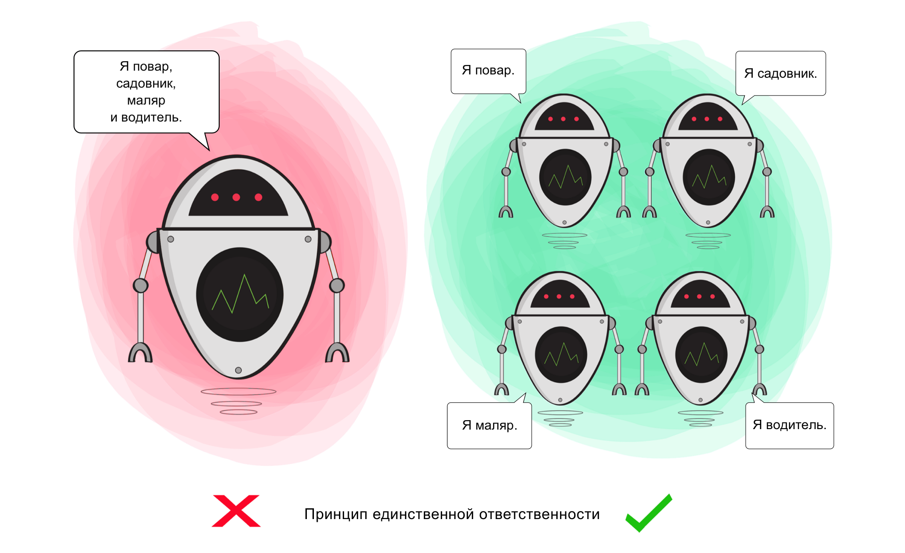

# Single Responsibility Principle (SRP)

<p align="center">
  
</p>


The Single Responsibility Principle (SRP) is a fundamental principle in software development that states that a class or module should have only one reason to change, meaning it should have only one responsibility or job. This principle promotes cohesion, maintainability, and extensibility by ensuring that each class or module is focused on a single concern.

## Problem

In software development, classes or modules often become bloated or tightly coupled when they have multiple responsibilities. This can lead to several issues, including:

- **Low cohesion**: Classes with multiple responsibilities may have methods or properties that are unrelated, leading to low cohesion and poor code organization.
- **High coupling**: Changes to one responsibility may inadvertently affect other parts of the class, leading to high coupling and making the codebase difficult to maintain and extend.
- **Difficulty in testing**: Classes with multiple responsibilities may be difficult to test, as it's challenging to isolate and test each responsibility independently.

## Solution

The Single Responsibility Principle addresses these issues by advocating for classes or modules with a single responsibility. By separating concerns into distinct classes or modules, each component becomes focused, cohesive, and easier to understand, maintain, and extend.

## Implementation

### Example

Consider a scenario where we have a `User` class that handles both user authentication and user profile management:

```java
public class User {
    public boolean authenticate(String username, String password) {
        // Authentication logic
        return true;
    }

    public void updateProfile(UserProfile profile) {
        // Profile update logic
    }
}
```
## Refactoring
```java
public class Authenticator {
    public boolean authenticate(String username, String password) {
        // Authentication logic
        return true;
    }
}

public class UserProfileManager {
    public void updateProfile(UserProfile profile) {
        // Profile update logic
    }
}

```

## Benefits
Improved maintainability: Classes with a single responsibility are easier to understand, maintain, and extend.

Enhanced cohesion: Each class focuses on a single concern, leading to higher cohesion and better code organization.

Reduced coupling: Separating concerns reduces dependencies between classes, leading to lower coupling and improved codebase flexibility.

## Considerations

Balance of responsibilities: While adhering to SRP is important, it's essential to strike a balance and avoid creating too many small classes or modules, which can lead to unnecessary complexity.


Domain-specific considerations: The definition of "responsibility" may vary based on the context and domain of the application. It's essential to consider domain-specific requirements when applying SRP.

