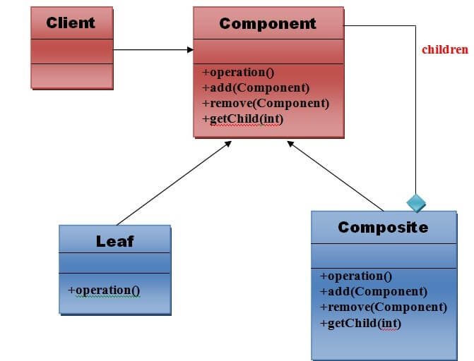

# Composition Design Pattern

<p align="center">
  
</p>


### Problem

The Composition design pattern addresses the problem of creating a tree structure to represent part-whole hierarchies. This pattern allows clients to treat individual objects and compositions of objects uniformly.

### Solution

The Composition design pattern proposes composing objects into tree structures to represent part-whole hierarchies. This allows clients to treat individual objects and compositions of objects in a consistent manner. The pattern involves:

- **Component**: An abstract class or interface for all objects in the composition.
- **Leaf**: A class representing the leaf objects in the composition.
- **Composite**: A class representing the composite objects, which may contain leaves or other composites.

### When to Use

Use the Composition design pattern when:

- You need to represent part-whole hierarchies of objects.
- You want clients to be able to treat individual objects and compositions of objects uniformly.
- You need to be able to add new kinds of components without changing the code that uses them.

### Example Code

```java
import java.util.ArrayList;
import java.util.List;

// Component
interface Graphic {
    void draw();
}

// Leaf
class Circle implements Graphic {
    @Override
    public void draw() {
        System.out.println("Drawing Circle");
    }
}

// Leaf
class Square implements Graphic {
    @Override
    public void draw() {
        System.out.println("Drawing Square");
    }
}

// Composite
class CompositeGraphic implements Graphic {
    private List<Graphic> children = new ArrayList<>();

    public void add(Graphic graphic) {
        children.add(graphic);
    }

    public void remove(Graphic graphic) {
        children.remove(graphic);
    }

    @Override
    public void draw() {
        for (Graphic graphic : children) {
            graphic.draw();
        }
    }
}

// Client Code
public class Main {
    public static void main(String[] args) {
        Circle circle1 = new Circle();
        Circle circle2 = new Circle();
        Square square = new Square();

        CompositeGraphic composite1 = new CompositeGraphic();
        composite1.add(circle1);
        composite1.add(square);

        CompositeGraphic composite2 = new CompositeGraphic();
        composite2.add(circle2);
        composite2.add(composite1);

        composite2.draw();
    }
}
```

### Cons

- **Complexity**: The design can become overly complex if not managed properly, especially with deep and intricate object hierarchies.
- **Overhead**: Managing the composite structure can introduce overhead, both in terms of performance and memory usage.
- **Child Management**: Ensuring correct handling of child components can be challenging, particularly when dealing with dynamic addition or removal of components.
- **Type Safety**: The uniform treatment of objects may lead to issues with type safety, making it harder to enforce specific behaviors for certain components.